<h1 align="center">Beyond the Wind Tunnel: Machine Learning for F1 Front Wing Aerodynamics</h1>

  <em>Can four regression models predict a Formula 1 front wing's aerodynamic efficiency and balance from raw CFD force and moment readings?</em>

  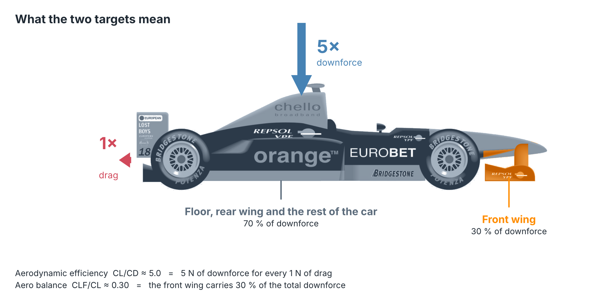

  Car illustration: <a href="https://freesvg.org/formula-one-car">"Formula One car"</a> from OpenClipart via freesvg.org (public domain, CC0), recoloured for this figure. Not part of the CFD data; it is only an illustration of what the two targets mean.

**Author:** Christopher Won  
**Institution:** Institut Polytechnique de Paris  
**Date:** April 2026

**Quick links:** [Notebook](Predicting_Aerodynamic_Efficiency_and_Balance.ipynb) · [Dataset](f1project_dataset.csv) · [Results](#results) · [Key findings](#key-findings) · [Reference](#reference)

---

## Overview

This project applies supervised regression to predict two aerodynamically meaningful targets from CFD simulation data of a Formula 1 front wing:

- **Aerodynamic Efficiency** (CL/CD): the downforce-to-drag ratio
- **Aero Balance** (CLF/CL): the front-to-total downforce ratio

The dataset consists of 5,000 CFD timesteps with 12 input features (pressure and viscous force/moment components across X, Y, Z axes), sourced from Shah (2025). The targets are derived from the coefficients published in that paper, but the models are given only the raw force and moment measurements, as if the coefficients were not available.

  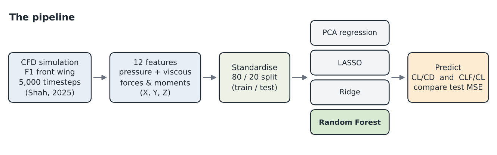

## The Data

Each row is one timestep of the simulation. Both targets spike during the first few hundred timesteps while the solver is still working out the airflow, then settle: efficiency at about **5.0** (5 N of downforce for every 1 N of drag) and balance at about **0.30**.

  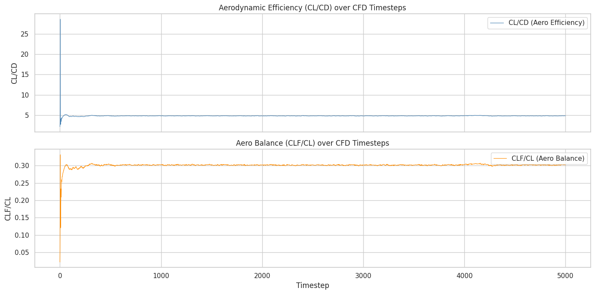

The same shape appears in the underlying forces. Pressure forces dominate: roughly 210 N of downforce and 40 N of drag at steady state, while viscous (skin friction) forces are a few newtons or less.

  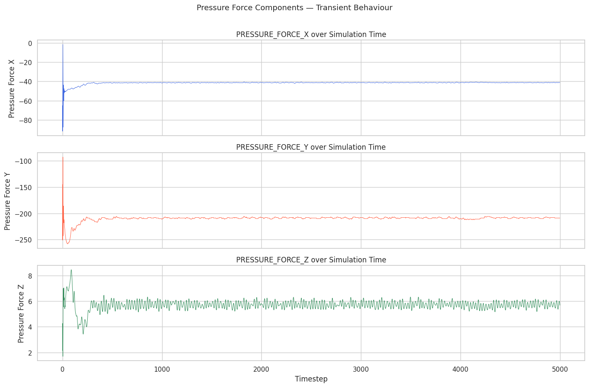

### Transient versus steady state

The first ~500 timesteps behave very differently from the rest. The boxplots below show the transient phase carrying all the extreme outliers, including a CL/CD value near 25 and CLF/CL swings between 0.05 and 0.35, while the steady-state phase is almost a single point. This transient phase is what makes CL/CD hard for linear models.

  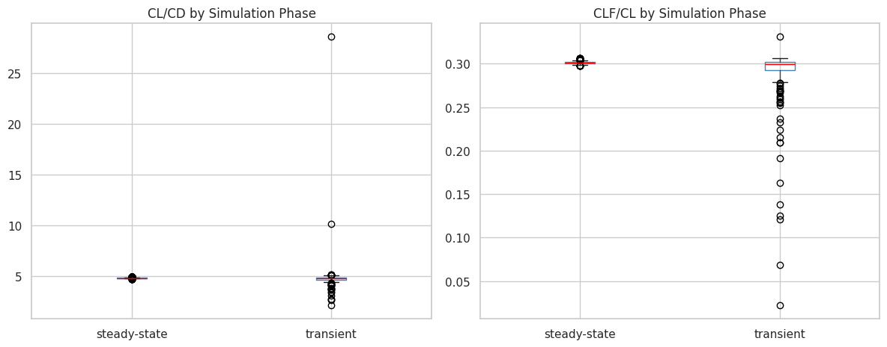

### Redundant features

The 12 features move together, so the information in them is highly redundant. Many pairs are strongly correlated, and PCA needs only 3 components to explain about 90% of the variance (PC1 alone is over 70%).

<table>
  <tr>
    <td align="center" width="50%">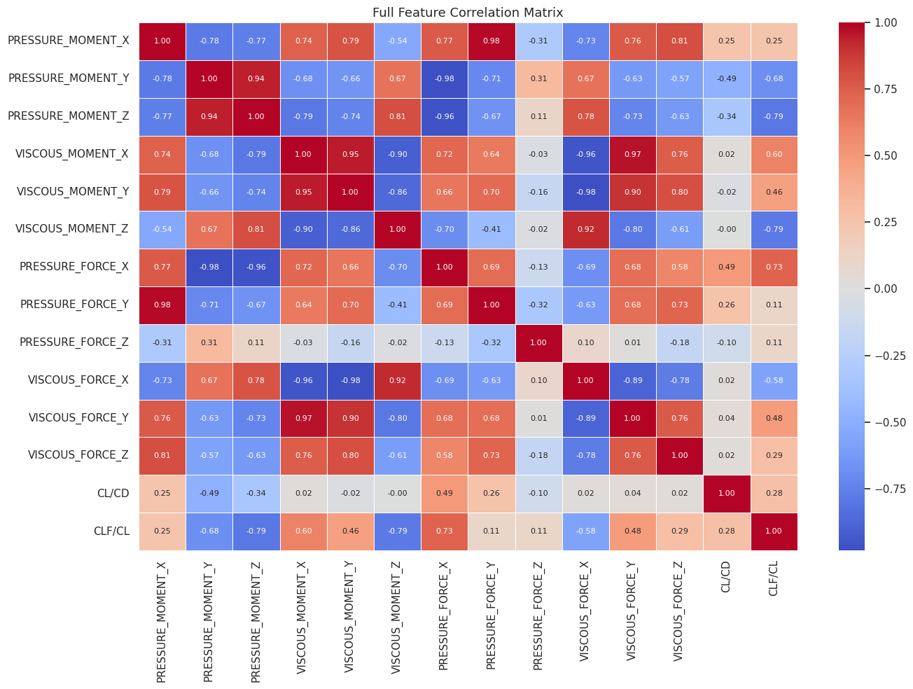</td>
    <td align="center" width="50%">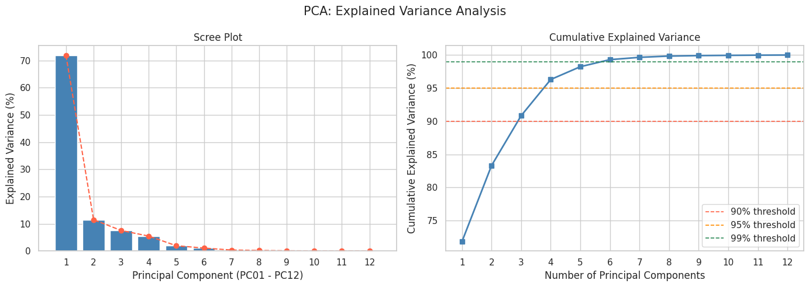</td>
  </tr>
  <tr>
    <td align="center"><b>Correlation matrix.</b> Strong blocks of correlated features</td>
    <td align="center"><b>PCA.</b> 3 components explain about 90% of variance</td>
  </tr>
</table>

<b>More data exploration</b>

 

<table>
  <tr>
    <td align="center" width="50%">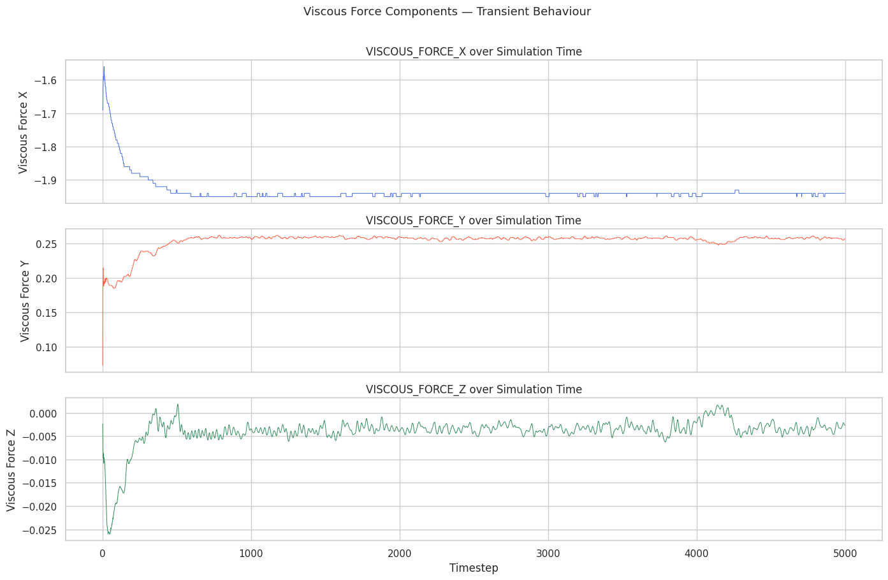</td>
    <td align="center" width="50%">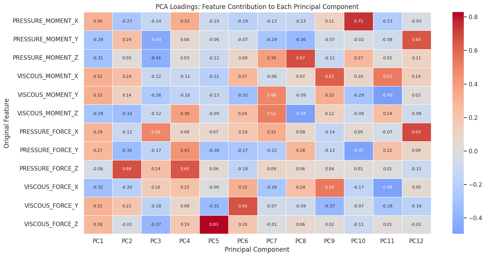</td>
  </tr>
  <tr>
    <td align="center"><b>Viscous forces</b> are orders of magnitude smaller than pressure forces</td>
    <td align="center"><b>PCA loadings:</b> which original features define each component</td>
  </tr>
</table>

  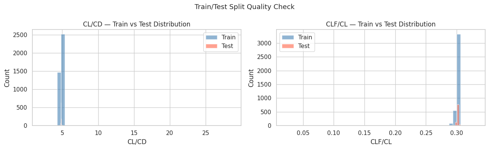

<b>Split check.</b> The 80/20 train and test target distributions overlap, so there is no distribution mismatch between them.

## Results

### Models compared

| Model | CL/CD MSE | CLF/CL MSE |
|---|---|---|
| PCA Regression (baseline) | 0.020249 | 0.000009 |
| LASSO Regression | 0.005883 | 0.000001 |
| Ridge Regression | 0.006566 | 0.000001 |
| **Random Forest** | **0.000204** | **0.000001** |

  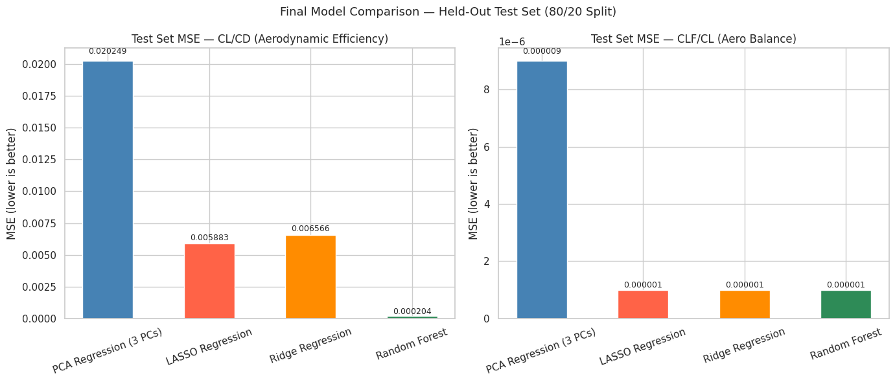

Random Forest is the decisive winner for CL/CD (about 99× lower MSE than PCA and 29× lower than LASSO), while all regularised methods perform comparably for aero balance.

### Predicted versus actual

Each panel plots held-out test predictions against the true values; points on the dashed line are perfect. For **CL/CD**, the linear models collapse their predictions toward the steady-state mean (about 4.8) and miss the transient timesteps, so their points form a flat band. Random Forest follows the diagonal across the whole range.

  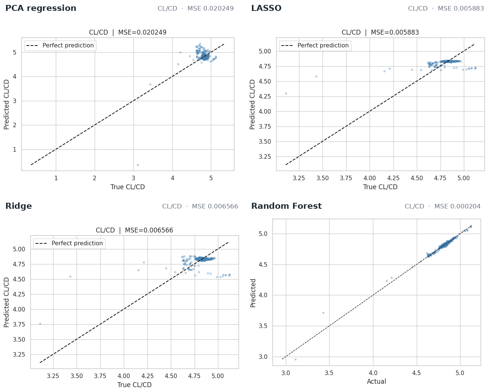

For **CLF/CL**, every model except the PCA baseline sits almost exactly on the line, which is why the choice of model barely matters for this target.

  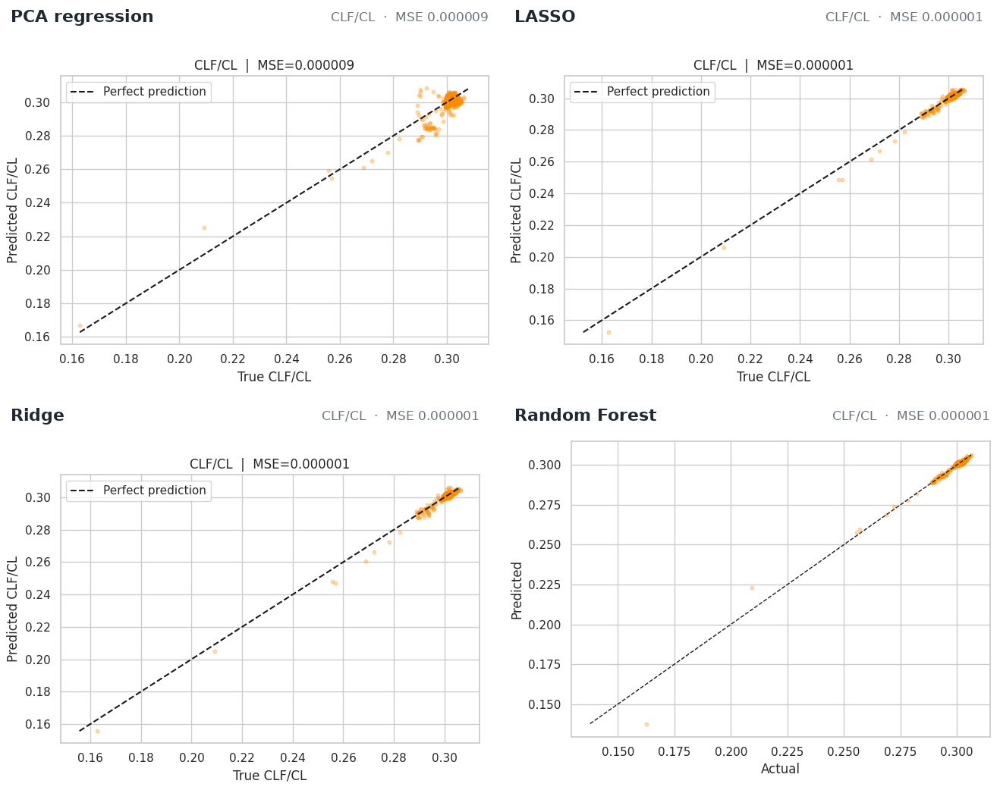

### Which features matter?

LASSO's L1 penalty zeroes out coefficients, which doubles as feature selection. For **CL/CD** it keeps just 2 of 12 features, `PRESSURE_MOMENT_Y` and `PRESSURE_FORCE_X`, which is physically sensible because drag directly enters the CL/CD denominator. For **CLF/CL** it keeps 7 of 12. All viscous force features are zeroed out for CL/CD, consistent with their tiny magnitude.

  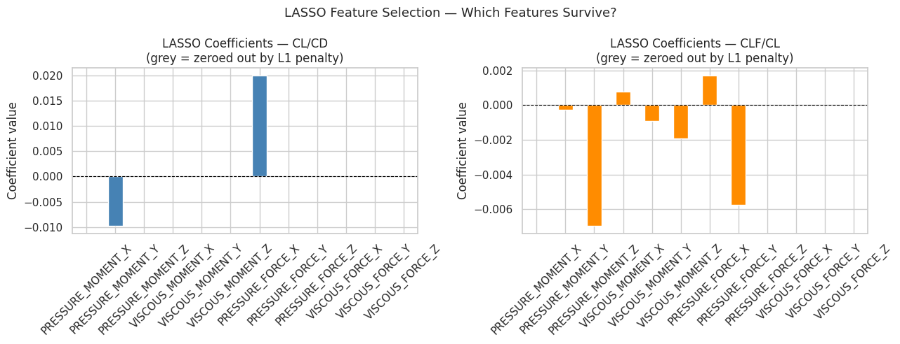

Random Forest tells a consistent story from a different angle. For CL/CD, `PRESSURE_FORCE_X` and `PRESSURE_FORCE_Y` carry the most importance; for CLF/CL, the moment features dominate, led by `VISCOUS_MOMENT_Z`, `VISCOUS_MOMENT_X` and `PRESSURE_MOMENT_Z`.

  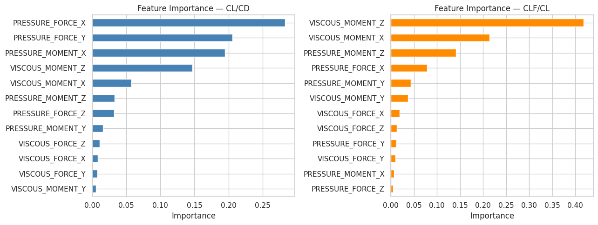

### How much data do the models need?

The degradation study retrains each model on smaller random subsets of the training data and scores it on the same fixed 1,000 timestep test set.

  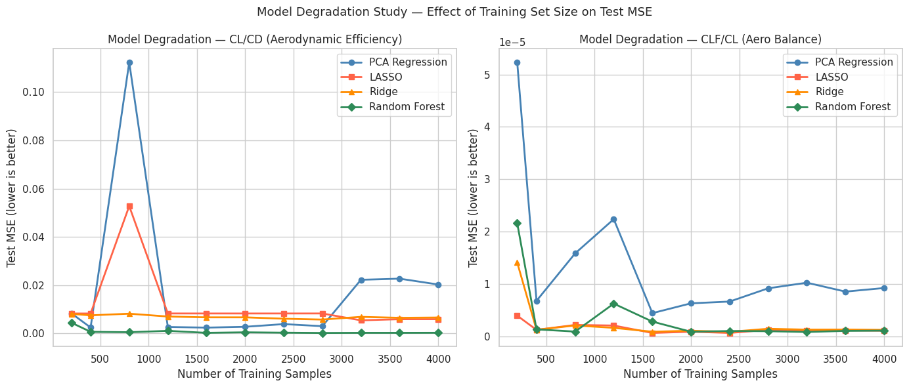

- **Random Forest** is both data-efficient and stable: with only 400 training samples (10% of the data) it already beats every linear model trained on the full dataset for CL/CD.
- **PCA regression** is fragile. At 800 samples its MSE jumps to 0.112, because that random draw happened to contain a disproportionate number of transient timesteps.
- **LASSO** shows a smaller spike at the same point (0.053).
- **Ridge** is the most stable linear method, staying between 0.006 and 0.008 at every fraction.

<b>Hyperparameter tuning and diagnostics</b>

 

All hyperparameters were chosen by 5-fold cross-validation on the training set (LASSO and Ridge: regularisation strength α; Random Forest: number of trees).

<table>
  <tr>
    <td align="center" width="50%">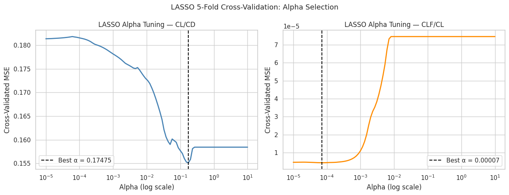</td>
    <td align="center" width="50%">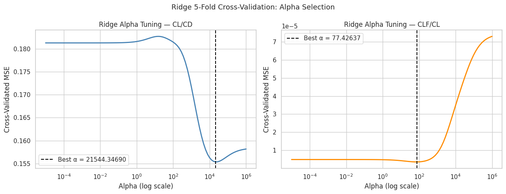</td>
  </tr>
  <tr>
    <td align="center"><b>LASSO:</b> best α = 0.174753 (CL/CD), 0.000071 (CLF/CL)</td>
    <td align="center"><b>Ridge:</b> best α = 21544.347 (CL/CD), 77.426 (CLF/CL)</td>
  </tr>
  <tr>
    <td align="center">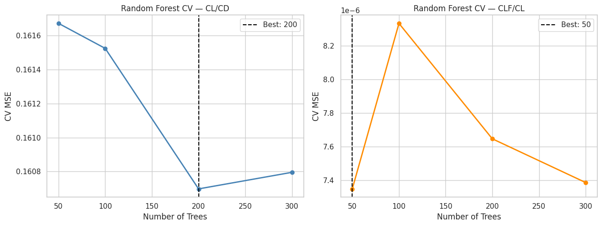</td>
    <td align="center">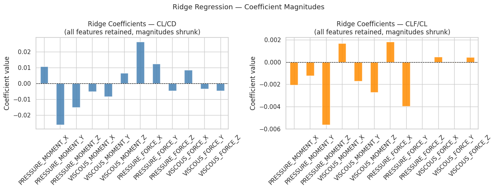</td>
  </tr>
  <tr>
    <td align="center"><b>Random Forest:</b> 200 trees (CL/CD), 50 trees (CLF/CL)</td>
    <td align="center"><b>Ridge coefficients:</b> none zeroed, all shrunk</td>
  </tr>
</table>

  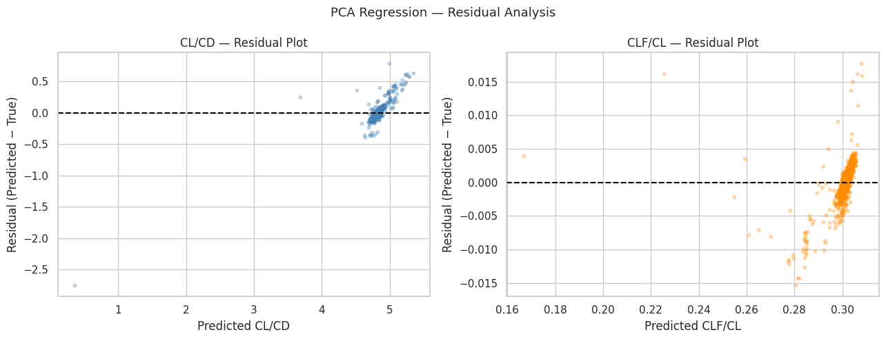

<b>PCA regression residuals.</b> Errors are small for most timesteps but systematically biased toward the steady-state mean.

## Key Findings

- **Random Forest** best captures the non-linear transient dynamics (about the first 500 timesteps), which linear methods cannot model.
- **LASSO** reduced CL/CD prediction to just 2 of 12 features (`PRESSURE_MOMENT_Y`, `PRESSURE_FORCE_X`), which is physically interpretable, as drag directly enters the CL/CD denominator.
- **Ridge** was the most stable linear method across data fractions in the degradation study.
- **Aero balance is a near-linear target**: model choice does not matter for CLF/CL.

> **The central finding:** the choice of regression method matters for aerodynamic efficiency (CL/CD) but not for aero balance (CLF/CL).

## Repository Contents

| File | Description |
|---|---|
| [`Predicting_Aerodynamic_Efficiency_and_Balance.ipynb`](Predicting_Aerodynamic_Efficiency_and_Balance.ipynb) | Full analysis notebook: data exploration, the derivations behind each model, results, and discussion |
| [`f1project_dataset.csv`](f1project_dataset.csv) | CFD dataset (5,000 timesteps, 12 features + targets) |
| [`images/`](images) | Figures from the notebook, used in this README |

## Reference

Shah, 2025. *Physics-Informed Neural Networks for F1 Aerodynamics*  
[https://arxiv.org/abs/2509.01963](https://arxiv.org/abs/2509.01963)
